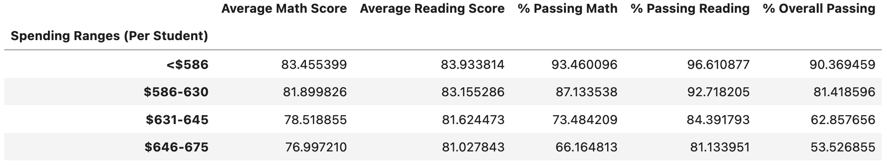
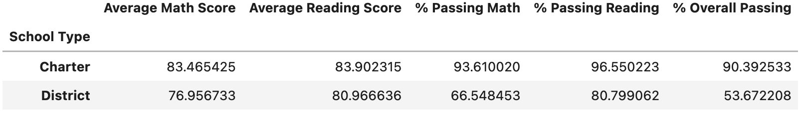

# School Disctrict Analysis

## Overview
The purpose of this analysis is to take student data from 15 high schools in the school district and provide key metrics, on a district and school level, based on standarized math and reading test scores. The goal of the analysis would be to provide these disctrict and school level key metrics in presentable dataframes to the district school board to assist with decision making and discussion. This analysis may assist with assessing school performance versus attributes including budget allocation, school size, and school type. 

After the initial analysis was completed, new information was given by the district school board that evidence of academic dishonesty had been found, compromising the integrity of a portion of the data. The data in question was the Thomas High School ninth grade-math and reading scores, which appeared to have been altered. The extent of the alteration was unknown, but in order to uphold state-testing standards, the team has decided to replace the Thomas High School ninth grade math and reading scores with NaNs, while keeping the rest of the dataset intact. The following report will provide the updated analysis, as well as comparisons to the previous analysis results to assess the impact of the data replacement on the new analysis results.

To begin, I replaced the Thomas High School ninth-grade math and reading scores with NaNs in the student dataframe.

Then I confirmed the updated data row counts (left) and NaN null counts (right) for each column of the the dataframe.

 

I confirmed that there were 461 ninth-grade students at Thomas High School, all of whose math and reading scores had successfully been replaced with NaNs. Once this was confirmed, I was ready to proceed with updating the rest of the analysis.

## Results
This section will cover the new analysis results and compare them with the previous analysis results, categorized by the following topics:

  - Key Metric Changes in the District Summary

  - Key Metric Changes in the School Summary

  - Effect of Replacing Ninth-Grade Scores on Thomas High School's Performance Ranking

  - Effect of Replacing Ninth-Grade Scores on the Following:

    - Math and Reading Scores by Grade

    - Scores by School Spending

    - Scores by School Size

    - Scores by School Type

### District Summary
District summary dataframe:

__Before NaNs__

__After NaNs__

Changes in key metrics:

  - _Total Students_ remained the same at 39,170. However, the 461 Thomas High School ninth-graders are not      included when calcululating the average scores and passing percentages. The remaining 38,709 students are used for these averages.

  - _Total Budget_ remained the same at $24,649,428.00.
    
  - _Average Math Score_ was affected negatively (decrease), with a 0.1 drop in the average score.  
    
  - _Average Reading Score_ was unaffected, with an average score of 81.9 before and after score replacements.
    
  - _% Passing Math_ was affected negatively (decrease), with a 0.2 point drop in passing percentage. 
    
  - _% Passing Reading_ was affected negatively (decrease), with a 0.3 point drop in passing percentage. 
    
  - _% Overall Passing_ was affected negatively (decrease), with a 0.1 point drop in passing percentage. 
    
While the total students in the school district and the total school district budget remained the same, the testing performance had a noticeable dip in most categories as a result of replacing the Thomas High School ninth-grade scores with NaNs. 'Average Math Score', '% Passing Math', '% Passing Reading', and '% Overall Passing' all decreased by 0.3 or less. Only the 'Average Reading Score' test performance metric remained the same. This shows that, while not severely, the altered Thomas High School ninth-grade data may have slightly inflated several of our previous analysis' test perfomance metrics. 

### School Summary
School summary dataframe:

__Before NaNs__

__After NaNs (Part 1)*__

__After NaNs (Part 2)**__

\* The second dataframe uses the student count of 1,635 for Thomas High School for percentage calculations (effectively treating the NaN values as 0 for such calculations).   
\*\* The third dataframe uses the student count of 1,174 for Thomas High School for percentage calculations (omitting the ninth-grade class and only including grades 10-12 in the student count).

Since the second dataframe gives us inaccurate output in passing percentage calculations, by effectively assuming all ninth grade scores to be 0, I will only be comparing the key metrics from the first (previous analysis) and third (only using THS grades 10-12 for percentage calculations) dataframes. All other (non-percentage passing) metrics are identical between the second and third dataframes.

Changes in key metrics:

  - _Total Students_ remained the same for all schools. However, the only the 1,174 students from Thomas High School in grades 10-12 were used for the percentage calculations in the third dataframe.

  - _Total School Budget_ remained the same for every school.

Testing score averages and passing percentages only changed for Thomas High School. The following will only refer to the key metrics Thomas High School.
    
  - _Average Math Score_ was affected negatively (decrease). The original score, 83.418349, dropped to 83.350937 ($\Delta$ = -0.067412)
    
  - _Average Reading Score_ was affected positively (increase). The original score, 83.848930, rose to 83.896082 ($\Delta$ = 0.047152)
    
  - _% Passing Math_ was affected negatively (decrease). The original percentage, 93.272171%, dropped to 93.185690% ($\Delta$ = -0.086481)
    
  - _% Passing Reading_ was affected negatively (decrease). The original score, 97.308869, dropped to 97.018739 ($\Delta$ = -0.29013)
    
  - _% Overall Passing_ was affected negatively (decrease). The original score, 90.948012, dropped to 90.630324 ($\Delta$ = -0.0317688) 

The total students and school budget for each school remained the same. The new analysis (third dataframe) being compared only includes grades 10-12 scores and percentage calculations for Thomas High School. "Average Math Score" decreased by less than 0.07, while "Average Reading Score" increased by nearly 0.05. These changes, while marginal, are noticable and suggest the ninth-grade scores were inflating the average math scores slightly and deflating the average reading scores slights for Thomas High School. The passing percentages were all affected negatively by the score replacement with NaNs. The largest different was the "% Passing Math" decrease of over 0.08 percentage points. This is still not a significant change in results overall, though further examination of the altered results may be needed to determine the extent of the impact on original testing performance metrics for Thomas High School.

### Thomas High School Performance Ranking (Post Scores Replacement)
Top five schools dataframe:

__Before NaNs__

__After NaNs__

Changes in Thomas High School performance relative to other schools:

After the ninth-graders' math and reading scores were replaced by NaNs, Thomas High School remained in the top five as the second ranked school out of the fifteen total schools in the school district. Only the 10-12 grade scores were used for Thomas High School's performance metrics after the ninth-grade scores were replaced by NaNs, differing from the other fourteen schools that included scores data for ninth-grade students.  

### Scores Replacement Effect on Scores Breakdown by Category
Math and reading scores (by grade) dataframe:

  - __Math and Reading Scores by Grade__  
    - __Math Scores Before NaNs__  
      

    - __Math Scores After NaNs__  
      

      The math scores by grade dataframe before and after replacing the Thomas High School scores with NaNs is nearly identical. However, the ninth-grade math score average is recorded as "nan" in the dataframe, for Thomas High School, after score replacement with NaNs.

    - __Reading Scores Before NaNs__  
      

    - __Reading Scores After NaNs__  
      

      The reading scores by grade dataframe before and after replacing the Thomas High School scores with NaNs is nearly identical. However, the ninth-grade reading score average is recorded as "nan" in the dataframe, for Thomas High School, after score replacement with NaNs.

Scores (by school spending) dataframe:

  - __Scores by School Spending__  

    - __Before NaNs__
      

    - __After NaNs__
      

      After Thomas High School ninth-grade scores were replaced by NaNs, the district average scores by school spending were affected in the "$631-645" spending bin.

        - _Average Math Score_ was affected negatively (decrease). The original score, 78.518855, dropped to 78.502002 ($\Delta$ = -0.016853)
    
        - _Average Reading Score_ was affected positively (increase). The original score, 81.624473, rose to 81.636621 ($\Delta$ = 0.012148)
            
        - _% Passing Math_ was affected negatively (decrease). The original percentage, 73.484209%, dropped to 73.462589% ($\Delta$ = -0.02162)
            
        - _% Passing Reading_ was affected negatively (decrease). The original score, 84.391793, dropped to 84.319261 ($\Delta$ = -0.072532)
            
        - _% Overall Passing_ was affected negatively (decrease). The original score, 62.857656, dropped to 62.778233 ($\Delta$ = -0.079423)

    The change in scores were marginal, with the largest change being a decrease of just under 0.08 percentage points in the "% Overall Passing" metric.

Scores (by school size) dataframe:          

  - __Scores by School Size__  
    
    - __Before NaNs__
      

    - __After NaNs__  
      

      After Thomas High School ninth-grade scores were replaced by NaNs, the district average scores by school size were affected in the "Medium (1000-1999)" size bin.

        - _Average Math Score_ was affected negatively (decrease). The original score, 83.374684, dropped to 83.361201 ($\Delta$ = -0.013483)
    
        - _Average Reading Score_ was affected positively (increase). The original score, 83.864438, rose to 83.873869 ($\Delta$ = 0.009431)
            
        - _% Passing Math_ was affected negatively (decrease). The original percentage, 93.599695%, dropped to 93.582398% ($\Delta$ = -0.017297)
            
        - _% Passing Reading_ was affected negatively (decrease). The original score, 96.790680, dropped to 96.732654 ($\Delta$ = -0.058026)
            
        - _% Overall Passing_ was affected negatively (decrease). The original score, 90.621535, dropped to 90.557997 ($\Delta$ = -0.063538)

        The change in scores were marginal, with the largest change being a decrease of just over 0.06 percentage points in the "% Overall Passing" metric.

Scores (by school type) dataframe:

  - __Scores by School Type__  

    - __Before NaNs__
      

    - __After NaNs__
      

      \*  
      After Thomas High School ninth-grade scores were replaced by NaNs, the district average scores by school type were affected in the Charter school type.

        - _Average Math Score_ was affected negatively (decrease). The original score, 83.473852, dropped to 83.465425 ($\Delta$ = -0.008427)
    
        - _Average Reading Score_ was affected positively (increase). The original score, 83.896421, rose to 83.902315 ($\Delta$ = 0.005894)
            
        - _% Passing Math_ was affected negatively (decrease). The original percentage, 93.620830%, dropped to 93.610020% ($\Delta$ = -0.01081)
            
        - _% Passing Reading_ was affected negatively (decrease). The original score, 96.586489, dropped to 96.550223 ($\Delta$ = -0.036266)
            
        - _% Overall Passing_ was affected negatively (decrease). The original score, 90.432244, dropped to 90.392533 ($\Delta$ = -0.039711)

        The change in scores were marginal, with the largest change being a decrease of just under 0.04 percentage points in the "% Overall Passing" metric.
    
    
## Summary
Below is a concise recap of the changes in the updated school district analysis after reading and math scores for the ninth-grade at Thomas High School were replaced with NaNs.

Key Changes in the School District Analysis:

- School District Summary
  - The school district summary changed with marginally (0.3 or less) decreased values in four key metrics: "Average Math Score", "% Passing Math", "% Passing Reading", "% Overall Passing". The rest of the key metrics remained unchanged.
- School Summary
  - The school summary changed with a single marginally (less than 0.07) increased value in the "Average Reading Score" key metric, and marginally (less than 0.05) decreased values in four key metrics: "Average Math Score", "% Passing Math", "% Passing Reading", "% Overall Passing".
- Thomas High School - Performance Ranking
  - Thomas High School remained in the top five as the second ranked school out of the fifteen total schools in the school district.
- Other Effects of Replacing NaNs
  - Math and Reading Scores by Grade
    - The dataframes are nearly identical. However, the ninth-grade math score and reading score averages are recorded as "nan" in the dataframe, for Thomas High School, after score replacement with NaNs.
  - Scores by School Spending
    - The scores by school spending changed with a single marginally (less than 0.01) increased value in the "Average Reading Score" key metric, and marginally (less than 0.08) decreased values in four key metrics: "Average Math Score", "% Passing Math", "% Passing Reading", "% Overall Passing".
  - Scores by School Size
    - The scores by school size changed with a single marginally (less than 0.07) increased value in the "Average Reading Score" key metric, and marginally (less than 0.07) decreased values in four key metrics: "Average Math Score", "% Passing Math", "% Passing Reading", "% Overall Passing".
  - Scores by School Type
    - The scores by school type changed with a single marginally (less than 0.01) increased value in the "Average Reading Score" key metric, and marginally (less than 0.04) decreased values in four key metrics: "Average Math Score", "% Passing Math", "% Passing Reading", "% Overall Passing".

 
    Overall, the changes in the analysis from replacing Thomas High School's ninth-grade schores with NaNs, was marginal and hardly affected the final results of the analysis. This is primarly because the 10-12 grade results for Thomas High School were on par with the previous score averages for Thomas High School including all four grade levels. Since we do not know the extent of the academic dishonesty and altered grades, we cannot determine how much including the ninth-grade results for Thomas High School, either, inflated or deflated our initial results for Thomas High School. If further investigation can reveal which grades were altered, as well as what the true original values of those grades are, we can update our analysis with the most accurate results including Thomas High School.   
